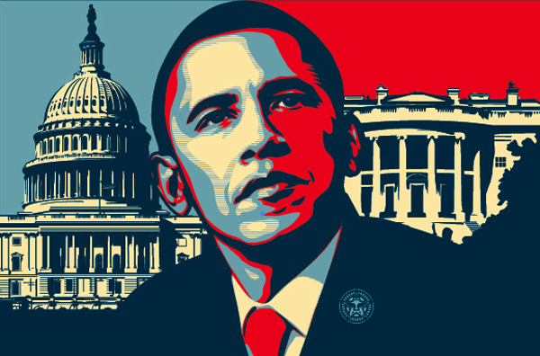

<br>

<br>


#### Synopsis:  

The objective of this project is to collect available social / public information about President Obama and present using R web scraping and visualization tools.  

<br>


#### Approach:  

* Collect Profile Summary from __Wikipedia__ 
* Collect news trends and global interest using __googletrends__
* Collect key __donors__ for President Obama and his 2012 challenger and look for trends
* Analyse the President's __State of the Union address__ over the last 6 years and look for shifts in policy priorities
* Analyse __tweets__ and perform sentiment analysis

<br>

```{r,echo=FALSE,echo=FALSE,warning=FALSE,message=FALSE}

# set-up environment
setwd("/Users/sundar/dev/projects/6_obama_online")
require(ggplot2)
require(wordcloud)
require(dplyr)

rerun <- 0 # (switch rerun to 1 to rerun get & process data steps)

if (rerun == 1) { 
        source("./1.0_load_libraries.R")
        source("./1.1_wiki_profile.R")
        source("./1.2_googletrends.R")
        source("./1.3_donors.R")
        source("./1.4_sotu_bigrams.R")
        source("./1.5_tweets.R")
        save.image(file="./obama.RData")
        rerun <- 0
} else { 
        load("./obama.RData")
}
```


<br>

#### 1.Wiki Profile: 

<br>

` Read profile from wiki`
<br>

```{r,echo=FALSE,eval=FALSE}

urlbio <- html('https://en.wikipedia.org/wiki/Barack_Obama')

profile <-  urlbio %>%  html_nodes(xpath = '//*[@id="mw-content-text"]/p[1]') %>% html_text() 

```

```{r,echo=FALSE,message=FALSE,warning=FALSE,results='asis'}

profile.out <- profile %>% toString(gsub("#"," ",.)) %>% gsub("\\.",".<br>",.) 
cat(profile.out)
```

<br>

#### 2.Obama in news: 


```{r,echo=FALSE,eval=FALSE}

googletrend::setdownloaddir('/Users/sundar/Downloads')

gtrend.regions <- gettrend(keyword='obama',plot=F,simple=F) 

geo.trend <- data.frame(gtrend.regions$top.region)
news.trend <- data.frame(gtrend.regions$trend)

# geo-code

gtrends.coordinates <- sapply(geo.trend$region,
                      function(x) taRifx.geo::geocode(x,service='bing',returntype='coordinates'))

gtrends.coordinates <- as.data.frame(t(as.data.frame(gtrends.coordinates)))

gtrends.geo <- cbind(geo.trend,gtrends.coordinates)
names(gtrends.geo)[3:4] <- c("lat","lon")

world.map <- map_data('world')


```

<br>

##### News Trend over time.

```{r,echo=FALSE,warning=FALSE,message=FALSE}

qplot(x=week,y=index,data=news.trend, xlab="Year", ylab="News Index",
                 main="President Obama in News") + geom_line(colour="blue")+ theme_bw()

```

It is interesting to note the 2012 news interest on Mr.Obama is much lesser than 2008. 

<br>

##### Interest across the globe.

```{r,echo=FALSE, message = FALSE, warning = FALSE }

ggplot() + 
    geom_polygon(dat=world.map, aes(long, lat, group=group), fill="white",xlab=NULL, ylab=NULL,
                 main="Obama news interest across the globe") + 
    geom_point(data=gtrends.geo,
               aes(x=gtrends.geo$lon, y=gtrends.geo$lat,
                   size=gtrends.geo$index,
                   position="jitter")) + 
    theme(legend.position='bottom')

```


It is interesting to note that interest in President Obama is disproportionately higher in Africa and Caribbean.


<br>

#### Top 2012 campaign donors : 


```{r,echo=FALSE}

require(igraph)
set.seed(5)
plot(donor.network,main="2012 key campaign donors")

```


Key donors to Mr.Obama's campaign seems to be spread across many groups such as universities , media companies, government employees and tech majors. 
Interestingly , majority of the donors to the republican challenger seems to be from the financial industry.
Deloitte is the only top donor who contributed to both the campaigns while others seem to have picked their sides.

<br>

#### 2010-15 SOTU bi-grams heat-map:


```{r,echo=FALSE,eval=FALSE}

# set-up functions 

BigramTokenizer <- function(x) NGramTokenizer(x, 
                                              Weka_control(min = 2, max = 2))

process_sotu <- function(sotu.in,year) { 
    
    sotu.in <- toString(sotu.in)
    
    corpus <- Corpus((VectorSource(sotu.in)))  %>%
        tm_map(.,content_transformer(function(x) iconv(x, to='UTF-8-MAC', sub='byte')))  %>%
        tm_map(.,content_transformer(tolower)) %>%
        tm_map(., removePunctuation)  %>%
        tm_map(., function(x) removeWords(x,stopwords())) %>% 
        tm_map(., removeWords, c("applause")) %>% 
        tm_map(., removeNumbers)  %>% 
        tm_map(., stemDocument)
    
    bitdm <- TermDocumentMatrix(corpus, control = list(tokenize = BigramTokenizer))  %>%
        removeSparseTerms(0.75)
    
    bigrams <- tbl_df(data.frame(cbind(as.numeric(unlist(bitdm[[3]])),unlist(bitdm[[6]][1])),stringsAsFactors =F))
    names(bigrams) <- c("freq","bigram")
    bigrams$freq <- as.numeric(bigrams$freq)
    bigrams$year <- year
    bigrams.out <- arrange(bigrams,desc(freq)) %>% filter(freq > 1 )
    
    return(bigrams.out)
}

# Process 2010 SOTU 

url2010 <- html('https://www.whitehouse.gov/the-press-office/remarks-president-state-union-address')
sotu2010 <-  url2010 %>%  html_nodes(xpath = '//*[(@id = "content")]//p') %>% html_text() 
bigrams.2010 <- process_sotu(sotu2010,2010)
head(bigrams.2010)

# Process 2011 SOTU 

url2011 <- html('https://www.whitehouse.gov/the-press-office/2011/01/25/remarks-president-state-union-address')
sotu2011 <-  url2011 %>%  html_nodes(xpath = '//*[(@id = "content")]//p') %>% html_text() 
bigrams.2011 <- process_sotu(sotu2011,2011)
head(bigrams.2011)


# Process 2012 SOTU 

url2012 <- html('https://www.whitehouse.gov/the-press-office/2012/01/24/remarks-president-state-union-address')
sotu2012 <-  url2012 %>%  html_nodes(xpath = '//*[(@id = "content")]//p') %>% html_text() 
bigrams.2012 <- process_sotu(sotu2012,2012)
head(bigrams.2012)

# Process 2013 SOTU 

url2013 <- html('https://www.whitehouse.gov/the-press-office/2013/02/12/remarks-president-state-union-address')
sotu2013 <-  url2013 %>%  html_nodes("#content div+ div") %>% html_text() 
bigrams.2013 <- process_sotu(sotu2013,2013)
head(bigrams.2013)

# Process 2014 SOTU 

url2014 <- html('https://www.whitehouse.gov/the-press-office/2014/01/28/president-barack-obamas-state-union-address')
sotu2014 <-  url2014 %>%  html_nodes(xpath = '//*[(@id = "content")]//p') %>% html_text() 
bigrams.2014 <- process_sotu(sotu2014,2014)
head(bigrams.2014)

# Process 2015 SOTU 

url2015 <- html('https://www.whitehouse.gov/the-press-office/2015/01/20/remarks-president-state-union-address-january-20-2015')
sotu2015 <-  url2015 %>%  html_nodes(xpath = '//*[(@id = "content")]//p') %>% html_text() 
bigrams.2015 <- process_sotu(sotu2015,2015)
head(bigrams.2015)


# Merge and spread 

bigrams <- rbind(bigrams.2010,
                       bigrams.2011,
                       bigrams.2012,
                       bigrams.2013,
                       bigrams.2014,
                       bigrams.2015)

#write.csv(file="./bigrams.csv",obama_bigrams,row.names=F)
#bigrams <- read.csv(file="bigrams.csv")


term_bigrams <- bigrams %>% spread(year,freq,fill="0",convert = T) 

names(term_bigrams) <- c("bigram","Y2010","Y2011","Y2012","Y2013","Y2014","Y2015") 

#head(term_bigrams)

term_bigrams <- mutate(term_bigrams,
                       total = Y2010 + Y2011 + Y2012 + Y2013 + Y2014 + Y2015)  %>% 
    filter(total >= 12)  %>% select(-total)  %>%  gather(yr,count, -bigram)

bigrams.scaled <- ddply(term_bigrams, .(yr), transform, rescale = rescale(count))


```


```{r,echo=FALSE}

(p <- ggplot(bigrams.scaled, aes(yr,bigram)) + 
      geom_tile(aes(fill = rescale),colour = "white") + labs(title="State of the Union - bigrams", x="Year", y="Frequent bigrams") + scale_fill_gradient(low = "white",high = "steelblue") + theme(legend.position = "none"))
 
```


__Key Observations__

* The President has mentioned clean energy during the early years of his presidency which seems to have come down over the years.
* Natural gas is appearing more frequently in the recent years , coinciding with the increase in American gas production.

<br>

#### Obama Twitter Analysis:

```{r,echo=FALSE,eval=FALSE}

official.tweets <- searchTwitter("@Barakobama",n=200000)

#Process official Tweets

official.df <- ldply(official.tweets,function(x) x$toDataFrame())
official_corpus <- Corpus(VectorSource(official.df$text))
official_corpus <- tm_map(official_corpus,
                          content_transformer(function(x) iconv(x, to='UTF-8-MAC', sub='byte')), mc.cores=1)

official_corpus <- tm_map(official_corpus, content_transformer(tolower), mc.cores=1) 
official_corpus <- tm_map(official_corpus, removePunctuation)
official_corpus <- tm_map(official_corpus, function(x) removeWords(x,stopwords()))
official_corpus <- tm_map(official_corpus, removeWords, c("barakobama","obama"))
official_corpus <- tm_map(official_corpus, removeNumbers)

official.tweets.df<-data.frame(text=unlist(sapply(official_corpus, `[`, "content")), 
                               stringsAsFactors=F)
official_corpus <- tm_map(official_corpus,stemDocument)


# official sentiment score


official.scores <- score.sentiment(official.tweets.df$text,pos,neg) 
official.scores$type <- "official"

# official Dendogram

official.tdm <- TermDocumentMatrix(official_corpus,
                                   control=list(wordLengths=c(1,Inf)))

official.tdm2 <- removeSparseTerms(official.tdm,sparse=0.95)

official.matrix <- as.matrix(official.tdm2)
official.dist <- dist(scale(official.matrix))
official.fit <- hclust(official.dist,method="ward.D2")


```

```{r,echo=FALSE,warning=FALSE,message=FALSE}
# official word cloud

set.seed(1)
layout(matrix(c(1, 2), nrow=2), heights=c(1, 4))
par(mar=rep(0, 4))
plot.new()
text(x=0.5, y=0.5, "Obama Tweets - Frequent words wordcloud")
wordcloud(official_corpus, min.freq=5,max.words=30,scale=c(5,0.5),
          random.order=FALSE, random.color=TRUE,rot.per=0.35, 
          use.r.layout=TRUE,colors=brewer.pal(8, "Dark2"))

```


```{r,echo=FALSE}

plot(official.fit,cex=0.9,hang=-1,main="Official Tweets Dendogram", 
     xlab="", ylab="",axes=F,sub="")
rect.hclust(official.fit,k=5)

```

There seems to be three key clusters of tweets over the last 7 days.

* Charter schools and funding related tweets.
* Spanish tweets.
* maryam rajavi Islam related tweets.

Let us check the sentiment of the tweets using simple word sentiment methodology.


```{r,echo=FALSE}

# Tweet Sentiment 

qplot(data=official.scores, x=score,main="Tweets - Sentiment analysis", 
     xlab="Sentiment score", ylab="Tweets",geom="density")  + theme_bw()


```

It seems the tweets have a slightly positive sentiment overall.

__Note:__

The tweets used for analysis are restricted to those with reference to official twitter handle @BarakObama  , there are a few other  unofficial handles referring to president Obama that might present a different sentiment score.

<br>


#### Conclusion:

I would have loved to analyse associations and social connections of the president using Facebook, but unfortunately Facebook friends details of the president is not available to access.  
However, we have uncovered quite a few interesting facts  using a quick analysis of available public / social information about President Obama. 


<br>
<br>


